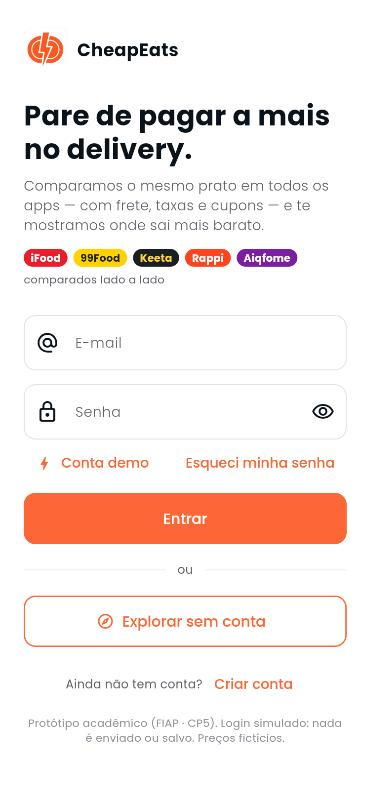
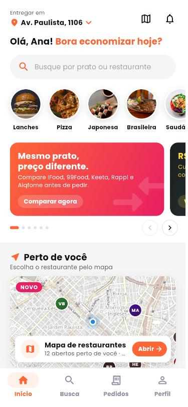
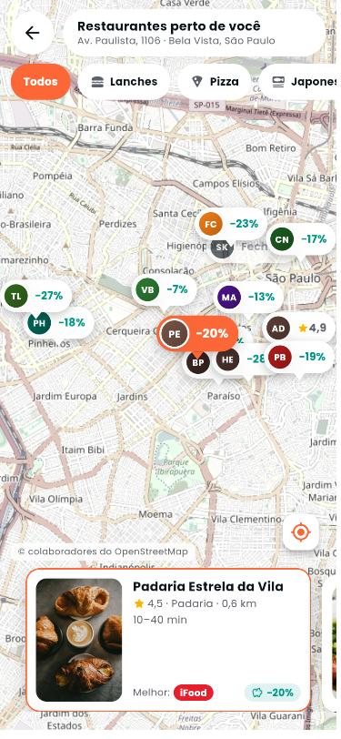
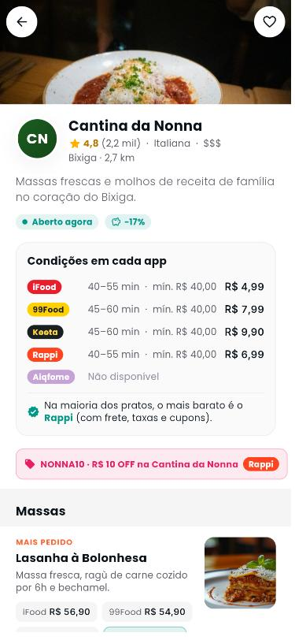
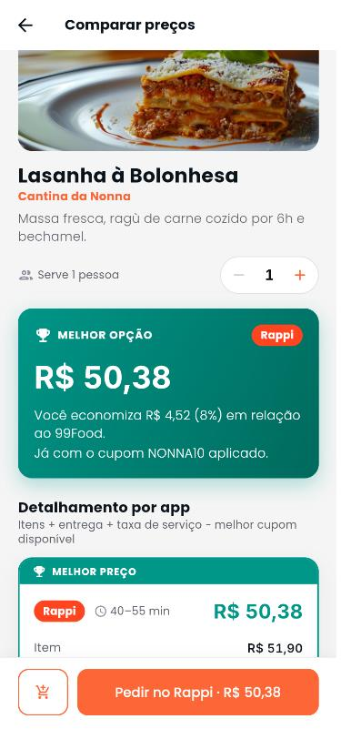
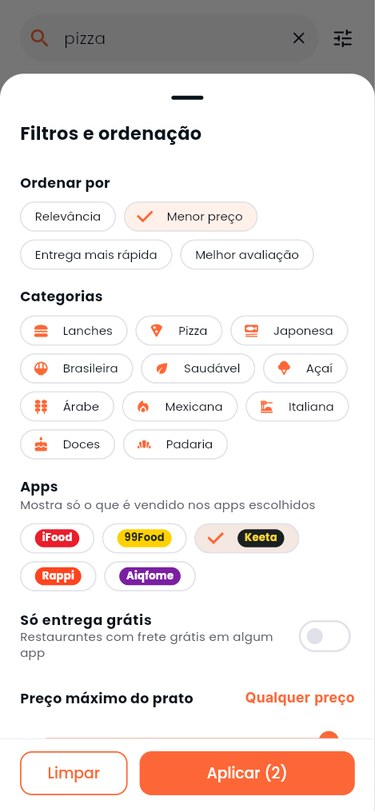
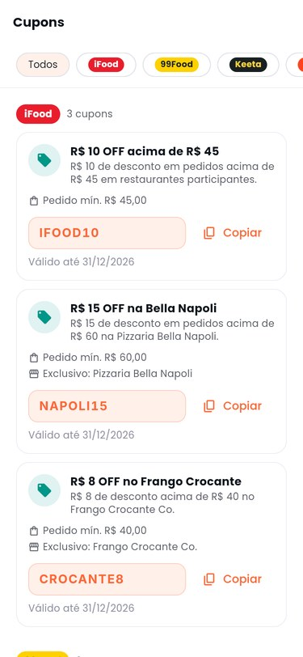
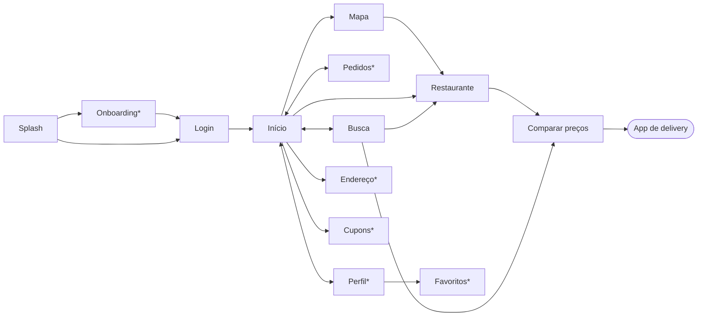
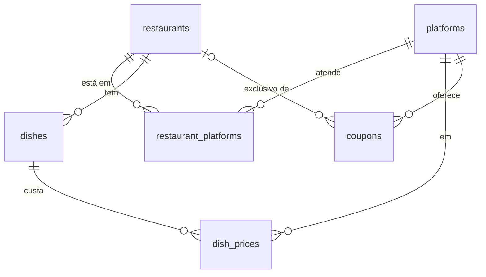

# CheapEats

**O faro fino do delivery.**
Agregador que compara o preço, a taxa de entrega e os cupons do **mesmo prato** no **iFood, 99Food, Keeta, Rappi e Aiqfome** e mostra onde ele sai mais barato.

> **Checkpoint 5 — Protótipo funcional.** App em Flutter com telas navegáveis, dados simulados realistas, mapa interativo, banco Supabase (com modo offline) e execução no Chrome ou no emulador Android.

| Login | Início | Mapa | Restaurante | Comparação | Filtros | Cupons |
| :---: | :---: | :---: | :---: | :---: | :---: | :---: |
|  |  |  |  |  |  |  |

## 👥 Integrantes do Grupo
*  Helena Barbosa Costa 562450
*  Henrique Mandrick  562715
*  Mateus Scandiuzzi Valente Tomomitsu 561565
*  Ryan Amorim de Castro Santana 564393
*  Thomas Joh Kobayashi 562758

## 🎯 O Problema e Público-Alvo
*   **Problema:** a alta variação de preços (até 30%) de um mesmo prato, por causa de taxas de entrega dinâmicas e cupons espalhados em vários aplicativos, gera desgaste e perda de tempo na pesquisa manual.
*   **Público-Alvo:** jovens profissionais, universitários e *heavy users* de delivery que querem otimizar o orçamento e economizar com inteligência.

## 📱 O que o protótipo faz

| Funcionalidade (MVP) | Como está no CP5 |
| --- | --- |
| **Comparador** (preço do item + frete + taxa − cupom) | ✅ Tela de comparação com o total nos 5 apps, do mais barato ao mais caro: detalhamento, economia em R$ e %, quantidade, pedido mínimo e "faltam R$ X para usar o cupom" |
| **Busca global** por prato ou restaurante | ✅ Busca sem acento, sinônimos, buscas populares/recentes, abas Pratos e Restaurantes, filtros (categoria, app, só entrega grátis, preço máximo) e ordenação (menor preço, entrega mais rápida, melhor avaliação) |
| **Mapa interativo** | ✅ Restaurantes próximos no mapa (OpenStreetMap), com a economia de cada um no pino, filtro por categoria e cards sincronizados com o mapa. Aparece em destaque na Início ("Perto de você") e em miniatura na Busca |
| **Deep link** para o app mais barato | ✅ Tela de redirecionamento, cupom para copiar e abertura do app escolhido |
| **Localização integrada** | ✅ Endereço no topo da Home e centro do mapa · ⏳ tela de endereços (Parte 1) |
| Login | ✅ Login simulado com validação, conta demo e "Explorar sem conta" |
| Cupons | ✅ Todos os cupons dos 5 apps agrupados por app, com filtro, regras (pedido mínimo, teto, 1º pedido, restaurante exclusivo), validade, "copiar código" e os expirados separados |
| Pedidos, perfil, favoritos | ⏳ Partes 1 e 3 (ver [divisão de tarefas](docs/cp5/TAREFAS.md)) |

### Fluxo de telas



`*` telas em desenvolvimento pela equipe no CP5 (já têm rota e tela provisória, então a navegação nunca quebra).

## ▶️ Como rodar

**Pré-requisitos:** [Flutter](https://docs.flutter.dev/get-started/install) 3.47 ou superior (Dart 3.13) e Google Chrome. Confira com `flutter doctor`.

```bash
git clone https://github.com/helenabc01/CheapEats.git
cd CheapEats
flutter pub get
flutter run -d chrome
```

* **Conta de teste (fictícia):** `ana.demo@cheapeats.app` / `cheap123`. O botão **Conta demo** preenche os campos para você. O login é simulado: qualquer e-mail válido + senha com 6 ou mais caracteres também entra, e nada é enviado ou salvo. Também dá para usar **Explorar sem conta**.
* **No Chrome (tela grande)**, o app aparece numa moldura de celular. Para ver em tamanho real, use `F12` → ícone de celular (Device Toolbar). Listas e carrosséis também podem ser arrastados com o mouse.
* **Sem internet ou sem o banco:** o app usa automaticamente os dados locais (o mapa e as fotos precisam de internet; sem ela aparecem ícones no lugar). Para forçar o modo offline:
  `flutter run -d chrome --dart-define=SUPABASE_URL=`
* **No VS Code:** aba *Executar e depurar* → escolha uma das configurações de `.vscode/launch.json`.

### Emulador Android (Android Studio)

1. Instale o [Android Studio](https://developer.android.com/studio) e, no primeiro uso, o Android SDK.
2. Rode `flutter doctor --android-licenses` e aceite as licenças.
3. No Android Studio: **Device Manager → Create Device → Pixel 7 → API 35** e inicie o emulador.
4. `flutter devices` (deve aparecer `emulator-5554`) e depois `flutter run -d emulator-5554`.

### Testes e qualidade

```bash
flutter analyze   # análise estática (0 problemas)
flutter test      # testes da regra de preço, dos dados, do fluxo principal e do mapa
```

## 🗄️ Banco de dados (Supabase)

O catálogo (apps, restaurantes, pratos, preços e cupons) fica no **Supabase**. Ao abrir, o app:

1. inicializa o Supabase com a *publishable key* (`lib/core/config/supabase_config.dart`);
2. lê as 6 tabelas em paralelo (`SupabaseCatalogRepository`);
3. se der erro ou demorar mais de 6 s, **usa os dados locais** (`MockCatalogRepository`). O selo "Dados: Supabase / locais" no fim da Home mostra a fonte usada.



O banco do grupo já está no ar (`https://vafmfwnszuvwyejgnqsm.supabase.co`) com todos os dados: 5 apps, 13 restaurantes, 71 pratos, 264 preços e 12 cupons. Para ter acesso ao painel, peça um convite ao Ryan.

**Recriar o banco** em um projeto Supabase novo: *SQL Editor* → rode `supabase/schema.sql` e depois `supabase/seed.sql`. Em seguida, troque a URL e a chave em `lib/core/config/supabase_config.dart`.
Se mudar os dados, edite `assets/data/cheapeats_mock.json` e gere o seed de novo:

```bash
dart run tool/gerar_seed_sql.dart
```

**Segurança:** a chave no app é a *publishable/anon key*, feita para ficar no cliente. As políticas de RLS deixam o catálogo **somente leitura**; a `service_role` nunca vai para o código.

## 🧪 Dados simulados

Não existe API pública de preços dos apps de delivery, e integrar com os cinco seria inviável no CP5. Por isso, todos os valores são **simulados**, mas seguem regras realistas:

* **13 restaurantes** fictícios em bairros de SP (Paulista, Vila Mariana, Aclimação, Pinheiros…), com coordenadas para o mapa, **71 pratos**, **264 preços** e **12 cupons**, em **5 apps**;
* cada app tem um perfil próprio:
  - **iFood:** está em quase tudo e tem cupons de restaurantes parceiros, mas cobra taxa de serviço;
  - **99Food:** cardápio sem acréscimo e frete grátis acima de R$ 40;
  - **Keeta:** agressivo com cupons, incluindo o de 1º pedido;
  - **Rappi:** frete e taxa de serviço maiores, mas com cupons fortes em pedidos altos;
  - **Aiqfome:** poucos restaurantes, cardápio mais barato e entrega mais lenta;
* **total = itens + entrega + taxa de serviço − melhor cupom**, calculado em centavos (`PriceCalculator`);
* nenhum app domina: o mais barato é o Keeta em 23 pratos, o iFood em 18, o 99Food em 12, o Rappi em 6 e o Aiqfome em 6 (há 2 empates e 6 pratos sem comparação). Nos pedidos válidos, a economia média é de ~14% e a máxima, de 28%. Isso é coerente com a variação de "até 30%" apontada no problema.

| Caso coberto | Onde ver no app |
| --- | --- |
| O app mais barato muda de prato para prato | Busca "pizza": o cardápio do 99Food é o mais barato, mas o total do iFood ganha (frete grátis + cupom) |
| Cupom exclusivo de restaurante decide o vencedor | Cantina da Nonna → Lasanha (Rappi, cupom `NONNA10`) |
| App pequeno vence no seu nicho | Tia Lu Comida Caseira → PF Bife Acebolado (Aiqfome, sem taxa de serviço) |
| Empate no melhor preço (desempate pelo tempo de entrega) | Padaria Estrela da Vila → Pão na chapa; Verde Bowl → Wrap |
| Pedido mínimo não atingido + sugestão de quantidade | Habibi Esfiharia → Esfiha de Carne (1 un. → "Usar 3 unidades") |
| Cupom quase válido ("faltam R$ 6,10") | Brasa & Pão → Smash Duplo (Keeta) |
| Cupom de 1º pedido que deixa de valer depois do pedido | Keeta `BEMVINDO15` (Sushi Kenzo → Combinado 40 peças) |
| Cupom com teto e cupom expirado | `KEETA10` (máx. R$ 8) · `VOLTA20` (expirado, nunca aplicado) |
| Item esgotado / não vendido em um app | Milkshake (Keeta: esgotado) · Pizza de Rúcula (sem Keeta) |
| Restaurante só em 1 ou 2 apps | Ateliê Doce Brigadeiro (só iFood) · Taco Loco (só 99Food e Keeta) |
| Restaurante fechado | Sushi Kenzo (abre às 18:00), em cinza na lista e "Fechado" no mapa |
| Preço promocional riscado | Combo Smash no Keeta (de R$ 52,90 por R$ 46,90) |

## 🏗️ Estrutura do código

```
lib/
├── main.dart                 # MaterialApp, rotas e moldura de celular no web
├── core/
│   ├── app_services.dart     # acesso aos serviços (catálogo, sessão, pedidos…)
│   ├── config/               # configuração do Supabase
│   ├── routes/               # todas as rotas do app
│   ├── services/             # sessão, endereço, favoritos, pedidos, deep link
│   └── utils/                # formatação (R$, tempo, distância)
├── data/
│   ├── models/               # Restaurant, Dish, Coupon, PriceQuote…
│   ├── repositories/         # Supabase, mock local e fallback entre os dois
│   ├── services/             # PriceCalculator (regra de preço)
│   ├── catalog.dart          # catálogo em memória + busca
│   └── search_filters.dart   # filtros da busca (Parte 2)
├── screens/                  # uma tela por arquivo (inclui map_screen.dart)
├── widgets/                  # componentes reutilizáveis (cards, badges…)
└── ui/theme.dart             # design system do CP4 (cores, fontes, componentes)
assets/data/cheapeats_mock.json   # fonte única dos dados simulados
supabase/                         # schema.sql e seed.sql
tool/gerar_seed_sql.dart          # gera o seed a partir do JSON
test/                             # testes automatizados
```

## 🧠 Decisões técnicas desde o CP4

| Decisão | Por quê |
| --- | --- |
| **Supabase** em vez de Firebase | SQL relacional combina com o domínio (restaurante → pratos → preços por app). Funciona igual no Web, Android e Windows, e o plano gratuito basta. |
| **Fallback automático para dados locais** | A apresentação não pode depender da internet da sala: se o banco falhar, o app segue com os mesmos dados. |
| **Um único JSON como fonte dos mocks** | O mesmo arquivo alimenta o modo offline e gera o `seed.sql`, então banco e app nunca divergem. |
| **5 apps comparados** (iFood, 99Food, Keeta, Rappi, Aiqfome) | Cobre os principais apps do Brasil. Os apps ficam em uma tabela (`platforms`), então entra um novo app sem mudar o código das telas. |
| **Mapa com `flutter_map` + OpenStreetMap** | Gratuito, sem chave de API e funciona no Web e no Android. O mapa recebe um filtro suave para os pinos se destacarem. |
| **Cálculo em centavos** | Evita erros de arredondamento (ex.: 3 × R$ 12,90 = R$ 38,70 exatos). |
| **Sem pacote de gerência de estado** | `ChangeNotifier` + `ListenableBuilder` (nativos do Flutter) mantêm o código simples para toda a equipe. |
| **Rotas nomeadas centralizadas** e telas provisórias | Cada integrante trabalha no próprio arquivo sem quebrar a navegação dos outros. |
| **Design system do CP4 no `theme.dart`** | Cores, escala tipográfica (Poppins) e estados de botão extraídos do Figma; preços em Inter com algarismos tabulares. Layout inspirado no iFood. |
| **Login simulado com conta demo** | O foco do CP5 é o fluxo de comparação; a autenticação real (Supabase Auth) fica para a próxima entrega. |
| **Moldura de celular e arrastar com mouse no Chrome** | Na apresentação pelo navegador, o app tem proporção e comportamento de celular. |
| **Fotos por URL com fallback** | Imagens livres (Unsplash) deixam o protótipo realista; sem internet, aparece o ícone da categoria. |

## 🎨 Design

* Figma (design system do CP4): https://www.figma.com/design/4vy0H4TBJ4kVD7B478flmt/CP1?node-id=0-1&p=f&t=aQ8le8RSQI2v8tBi-0
* Paleta: Laranja `#FD6737` (principal e botões; hover `#D73E1C`, desabilitado `#B3B3B3`), Teal `#009688` (economia e melhor preço), Rosa `#E91E63`/`#ED5E91` (promoções), Erro `#E05744`, textos `#0A121A` / `#5C6068` / `#8D8F9F`.
* Tipografia: **Poppins** (H2 28 · H3 24 · H4 18 · H5 16 · H6 14 · Body 16/14 · Button 14 · Label 12) e **Inter** para os preços.
* **Conceito da marca:** o app é um "hacker ético" financeiro (*Cheap* + *Eats*), com tom pragmático e transparente.

## 🗺️ Status do CP5 e divisão de tarefas

| Parte | Responsável | Status |
| --- | --- | --- |
| Base, dados simulados (5 apps), regra de preço, Supabase, Login, Início, Busca, Mapa, Restaurante, Comparação, testes e documentação | Ryan | ✅ concluído |
| Parte 1 — Onboarding + Endereço + Perfil | Henrique | ⏳ |
| Parte 2 — Filtros da busca + Cupons | Mateus | ✅ concluído |
| Parte 3 — Pedidos (Supabase) + Favoritos | Helena | ⏳ |

Detalhes de cada parte, arquivos e critérios de aceite: **[docs/cp5/TAREFAS.md](docs/cp5/TAREFAS.md)**.

## 🎤 Roteiro da demonstração (≈ 3 min)

1. **Splash → Login:** mostrar a validação, tocar em **Conta demo** e entrar.
2. **Início:** endereço, categorias, o carrossel com um cupom de cada app (**Ver cupons** abre todos os cupons por app, com "copiar código") e a vitrine **Economia do dia**.
3. **Mapa:** tocar no card "Perto de você" da Início; mostrar a economia no pino, filtrar por categoria e abrir um restaurante pelo card.
4. **Busca "pizza":** o cardápio mais barato (99Food) **não** é o melhor total (iFood, com frete grátis + cupom). Essa é a proposta do app. Nos **filtros**, ordenar por menor preço ou deixar só o Keeta (a Pizza de Rúcula some, porque não é vendida lá).
5. **Restaurante:** condições em cada app (frete, tempo, mínimo), cupons e cardápio comparado.
6. **Comparar:** mudar a quantidade, ver pedido mínimo, cupom aplicado e economia; **Pedir no app** abre o app vencedor.
7. **Casos especiais:** restaurante fechado (Sushi Kenzo), restaurante em um app só (Ateliê Doce Brigadeiro), empate (Padaria) e Aiqfome vencendo na comida caseira (Tia Lu).
8. Fechar mostrando o selo **Dados: Supabase** e o painel do Supabase com as tabelas.
